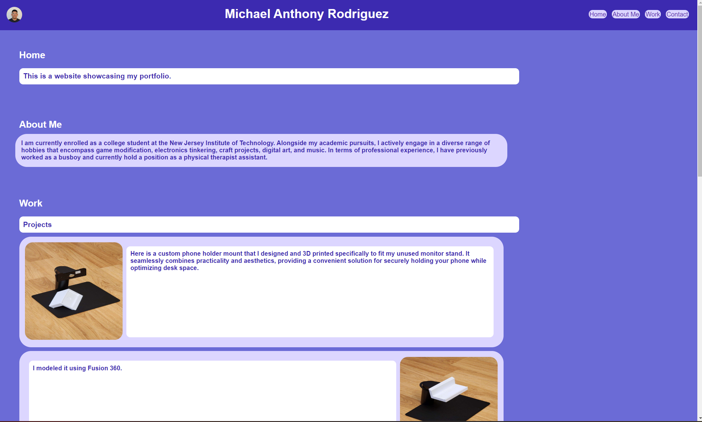

# <Your-Project-Title>

## Description

My motivation behind this project was to create a portfolio website with a style that fits my personality. I chose to build this project because I wanted to get more practice with working with CSS. The problem that my project solves is that it makes my portfolio easy to navigate and simple to use. While working on this project I learned more about how to format in CSS and organizing my code.

## Table of Contents (Optional)

If your README is long, add a table of contents to make it easy for users to find what they need.

- [Installation](#installation)
- [Usage](#usage)
- [Credits](#credits)
- [License](#license)

## Installation

- Navigate to the website of my Github profile: https://github.com/mikorod622/My_Portfolio
- Click the "<> Code" icon
- Click "Download ZIP"

## Usage

Clicking either of the texts on the website highlighted here will sent the user down to the corresponding category

## Credits

- Third-party links: https://samsungpartsusa.com/products/bn96-52531c
https://buybigjoe.com/products/refill?variant=32704835813513
https://www.freeplaytech.com/product/freeplay-zero-diy-kit/
https://five-nights-at-freddys.fandom.com/fr/wiki/Freddy_Fazbear

- README template provided by: https://coding-boot-camp.github.io/full-stack/github/professional-readme-guide

## License

The last section of a high-quality README file is the license. This lets other developers know what they can and cannot do with your project. If you need help choosing a license, refer to [https://choosealicense.com/](https://choosealicense.com/).

---

🏆 The previous sections are the bare minimum, and your project will ultimately determine the content of this document. You might also want to consider adding the following sections.

## Badges

## Features
This is the site in a normal desktop browser

This is the website in a mobile browser

Hovering over the project images expands them and also link to another page.

---

Link to website: https://mikorod622.github.io/My_Portfolio_Homework_Challenge_Website/

